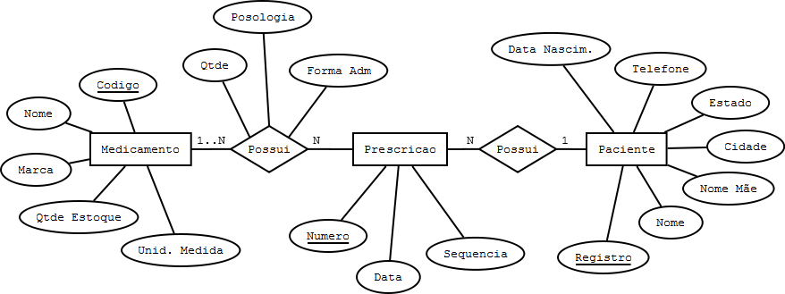
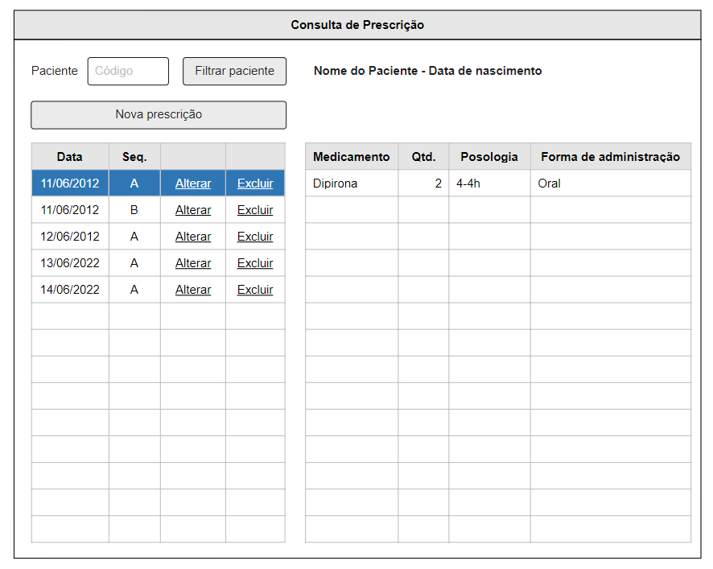
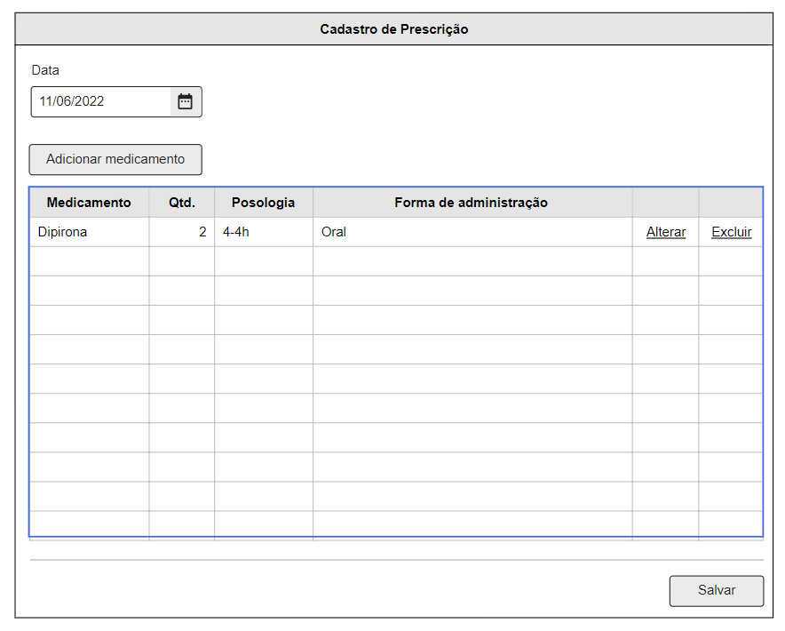
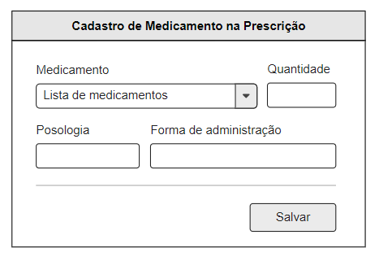

# Prova

Faça uma aplicação para resolver o problema de prescrição médica de pacientes internados em um hospital. Será necessário para isto criar um esquema de banco de dados que represente o seguinte modelo de entidade relacionamento.



Serão considerados os seguintes itens para avaliação da prova:

- Coerência do esquema do banco de dados
- Funcionalidade e facilidade de uso das páginas
- Validações e consistência da entrada de dados de acordo com modelo proposto

**O único desenvolvimento obrigatório é a página de manipulação da prescrição**. Páginas como cadastro de paciente e medicamentos não precisam ser implementadas, mas seus dados podem ser incluídos diretamente no banco de dados para efeito de testes.

Abaixo estão as sugestões de páginas para resolver o problema da prescrição. 

## Consulta de prescrição



A página acima tem como objetivo consultar as prescrições de um paciente. É composta por uma pesquisa pelo código do paciente, uma tabela que exibe todas as prescrições do paciente selecionado e ao clicar sobre a prescrição, exibe todas os medicamentos prescritos da prescrição selecionada. 

## Cadastro de prescrição



A página acima tem como objetivo cadastrar ou alterar uma prescrição. É composta pela data da prescrição e os medicamento prescritos.

## Cadastro de medicamento na prescrição



A página acima tem como objetivo cadastrar ou alterar um medicamento da prescrição. É composta por um *select* com os medicamentos disponíveis para que o usuário selecione um medicamento, também possui a quantidade, posologia e forma de administração prescrita.

# Tecnologias

## Backend

O backend da aplicação deverá ser desenvolvido utilizando [Laravel](https://laravel.com/docs/9.x) e o banco de dados **MySQL/MariaDB**. Este projeto já possui o **Laravel 9** configurado na raiz.

Caso seja o primeiro uso do projeto, é necessário fazer a instalação das dependências através do comando `composer install`.

A rota principal da API pode ser acessada através do endereço [http://prova.test/api](http://prova.test/api).

## Frontend

O frontend da aplicação deverá ser desenvolvido utilizando [Angular](https://v14.angular.io/docs). Este projeto já possui o **Angular 14** configurado na pasta [frontend](/frontend/).

Caso seja o primeiro uso do projeto, é necessário fazer a instalação das dependências através do comando `npm install` dentro da pasta frontend.

Para iniciar a aplicação basta entrar na pasta frontend no terminal, rodar o comando `ng serve` e então acessar o endereço [http://localhost:4200/](http://localhost:4200/) no navegador.

** Sugerimos a utilização do [Bootstrap](https://getbootstrap.com/) ([ng-bootstrap](https://ng-bootstrap.github.io/#/home)) para facilitar a criação das páginas.

# Clone

Se preferir, você pode clonar o projeto em seu computador.

```
git clone https://github.com/fivetechbauru/prova
```

Porém, será necessário ter instalado os requerimentos do **Laravel** (PHP 8+, Apache/Nginx e MySQL/MariaDB) e do **Angular** (Node 14+).